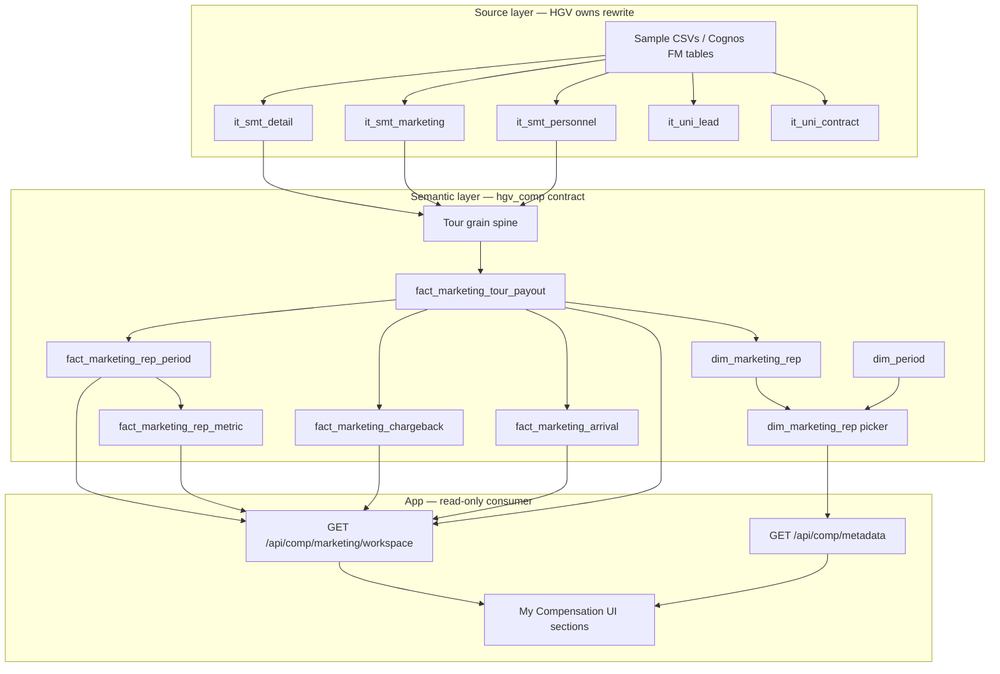

# HGV Marketing Compensation Hub — UI Data Contract

**Audience:** HGV data / comp engineering team  
**Purpose:** Document every UI section that reads warehouse data, the exact tables/columns the app expects, and how the `hgv_comp` semantic layer fits in. Use this to **rewrite ETL/SQL** so you can load from the sample CSV base tables (or production Cognos equivalents) and **only surface data in this structure** — no app changes required.

**App:** HGV Compensation Hub (`MarketingCompensationView` — “My Compensation” for Marketing Representative)  
**Catalog:** `edw_dev_hris.hgv_comp` (configurable via `COMP_CATALOG` / `COMP_SCHEMA` env vars)  
**Reference SQL today:** `data/comp/edw_dev_hris/16_materialize_marketing_core.sql` (materialized Delta) and `12_bootstrap_live_source_views.sql` (live views — deprecated for VDI performance)

---

## 1. Architecture overview



### What the semantic layer does

| Role | Description |
|------|-------------|
| **Contract** | The app never queries Cognos directly. It only reads named objects in `hgv_comp` with fixed column names and types (see §4). |
| **Grain shift** | Source data is transaction-level (`it_smt_detail`) and tour-key-level (`it_smt_marketing`, `it_smt_personnel`). The semantic layer collapses to **tour grain** and **rep×period grain**. |
| **Denormalization** | KPIs, plan metrics, chargebacks, and arrivals are pre-joined or rolled up so the Node server runs simple `SELECT … WHERE rep_id AND period_id` queries (sub-second on materialized Delta). |
| **Dependency** | **Hard dependency:** if `fact_marketing_rep_period` has no row for `(rep_id, period_id)`, the workspace API errors. Empty `dim_marketing_rep` → empty rep dropdown. Tour ledger drives most visible numbers. |

### What the app computes (not in warehouse)

These are **derived in TypeScript** from warehouse payloads — HGV does **not** need to populate them separately:

| Derived artifact | Source |
|------------------|--------|
| Money Map (Rule of Three, plan progress bars) | `shared/marketingMoneyMap.ts` from KPIs + plan_metrics + tours |
| Plan metric earnings alignment | `shared/marketingEarningsAlign.ts` rebalance metric $ to match `qtd_earnings` |
| Desk rank | `marketingMoneyMap.ts` — ranks peers on same `team_id` |
| AI insight text | LLM over serialized workspace context (no extra SQL) |
| Plan assessment fallback | Static catalog if `plan_assessment_*` tables empty |

---

## 2. Source data — CSV samples → production tables

Sample files at repo root map to Cognos FM tables used in current SQL:

| CSV file | Production table | Join key | Role |
|----------|------------------|----------|------|
| `detail.csv` | `edw_dev_cognos.cognos_fm.it_smt_detail` | `tour_key_hash`, `tour_id`, `enterprise_lead_id` | Transaction grain: showed, qualified, net_volume, tour_date |
| `marketing.csv` | `edw_dev_cognos.cognos_fm.it_smt_marketing` | `tour_key_hash`, `tour_id` | Tour booking: office, channel, program, `tour_booked_date` |
| `personnel.csv` | `edw_dev_cognos.cognos_fm.it_smt_personnel` | `tour_key_hash` | **Marketing rep = `opc_person_1_employee_id` / `opc_person_1_name`** (not `salesperson_1_*`, which is field sales) |
| `uni_lead.csv` | `edw_dev_cognos.cognos_fm.it_uni_lead` | `enterprise_lead_id` | Guest / household demographics (guest 360) |
| `uni_contract.csv` | `edw_dev_cognos.cognos_fm.it_uni_contract` | `contr_num`, `tour_id` | Contract volume, status (sales linkage) |
| `commissions.csv` | `edw_dev_hris.pwcmodels.commissions` | `participant` | Field sales comp (not marketing channel picker) |

### Recommended join spine (tour grain)

```
it_smt_marketing (tour booked, office, channel)
    ON tour_key_hash
it_smt_detail (showed, qualified, net_volume, tour_date)  — GROUP BY tour_key_hash, tour_id
    ON tour_key_hash
it_smt_personnel (opc_person_1_* for marketing rep credit)
```

**Period assignment:** `period_id` = `YYYY-Qn` from tour date (calendar quarter of `tour_date` or `tour_booked_date`).

---

## 3. UI section → API → warehouse mapping

Page: **My Compensation — Marketing Representative** (`client/src/pages/comp/MarketingCompensationView.tsx`)

### 3.0 Global chrome — Rep & period picker

| UI | API | Warehouse object | Query |
|----|-----|------------------|-------|
| Rep dropdown | `GET /api/comp/metadata` | `dim_marketing_rep` | See §5.1 |
| Period dropdown | `GET /api/comp/metadata` | `dim_period` | See §5.2 |

**Filter rules (app-side):** excludes `rep_id LIKE 'PERSONA-MKT-%'`; max 500 marketing reps.

---

### 3.1 Hero strip — “Your 3 numbers that matter”

| Widget | Fields shown | Warehouse source |
|--------|--------------|------------------|
| What I earned | `kpis.qtd_earnings` | `fact_marketing_rep_period.qtd_earnings` |
| Am I on track? | `kpis.penetration_pct` vs `penetration_target_pct` | `fact_marketing_rep_period` |
| What’s next | `kpis.next_tier_label`, `next_tier_gap_tours` | `fact_marketing_rep_period` |

**API:** `GET /api/comp/marketing/workspace?rep_id=&period_id=`  
**Primary SQL:** §5.3 (`fact_marketing_rep_period` + `dim_period`)

---

### 3.2 Rule of Three / Money Map / Plan progress / Desk rank

| Widget | Data used |
|--------|-----------|
| `MarketingRuleOfThreeBars` | `kpis`, `plan_metrics`, `money_map` |
| `MarketingMoneyMapSummary` | `money_map` (computed) |
| `MarketingPlanProgressBars` | `plan_metrics` |
| `MarketingDeskRankCard` | Desk rank query §5.9 |

**Warehouse:** `fact_marketing_rep_period`, `fact_marketing_rep_metric`, `fact_marketing_tour_payout` (tour chips). Money map itself is **not** a table.

---

### 3.3 KPI cards (advanced view)

| Card | Column |
|------|--------|
| QTD earnings | `qtd_earnings`, `paid_to_date` |
| Qualified tours | `qualified_tours`, `tours_shown`, `show_rate_pct` |
| Penetration | `penetration_pct`, `penetration_target_pct` |
| Next tier | `next_tier_label`, `next_tier_gap_tours`, `spiff_active` |

**Source:** `fact_marketing_rep_period` via workspace API.

---

### 3.4 Earnings breakdown & pay mix

| UI | Fields | Warehouse |
|----|--------|-----------|
| Earnings breakdown | `qualified_tour_pay`, `courtesy_tour_pay`, `penetration_spiff`, `chargebacks`, `total_payout`, `net_payout` | `fact_marketing_rep_period` (+ app aligns net) |
| Pay mix | `base_pct`, `variable_pct` | `fact_marketing_rep_period` |
| Market position | `tcc_gap_vs_market_pct` | `fact_marketing_rep_period` (optional: `fact_rep_market_position` for manager views) |

---

### 3.5 Earnings by Plan Metric

| UI component | Warehouse |
|--------------|-----------|
| `EarningsByPlanMetricTable` | `fact_marketing_rep_metric` |

**Expected rows per rep×period:** 3 metrics (names flexible; weights should sum ~100):

| metric_name (current seed) | weight_pct | attainment driver |
|----------------------------|------------|-------------------|
| Qualified Tours | 40 | `penetration_pct` |
| Show Rate | 35 | `show_rate_pct` |
| Qualified Tour Pay | 25 | qualified tour count tier |

---

### 3.6 Tour Activity & Credits

| UI | Warehouse |
|----|-------------|
| `MarketingTourActivitySection` | `fact_marketing_tour_payout` (+ optional guest enrichment) |

**Per-tour columns required:**

| Column | Description |
|--------|-------------|
| `tour_id` | PK for intervene drawer |
| `rep_id`, `period_id` | Filters |
| `guest_name`, `guest_type` | Display (Qualified / Showed / Courtesy) |
| `arrival_date` | Tour date |
| `tour_status`, `code` | Status / desk code |
| `payout` | Tour-level earnings |
| `fps_eligible`, `fps_potential` | FPS upsell display |
| `notes` | Free text (e.g. marketing program) |
| `guest_id`, `household_id` | Guest 360 joins |
| `lead_source`, `abc_score`, `package_type` | Quality chips |
| `xref_tour_id`, `tour_booked_date` | Cross-refs |

**Enrichment (optional):** `enrichMarketingTours()` joins `dim_guest`, `dim_household`, `dim_location`, `fact_tour_quality`, `fact_guest_*`. If enrichment fails, app falls back to base tour columns only.

---

### 3.7 Chargebacks

| UI | Warehouse |
|----|-------------|
| `ChargebacksAndArrivals` (chargeback table) | `fact_marketing_chargeback` |

| Column | Notes |
|--------|-------|
| `chargeback_id` | Unique |
| `rep_id`, `period_id` | Filter |
| `guest_name`, `tour_id` | Display |
| `premium_gift` | Optional |
| `chargeback_amount` | Positive $ |
| `notes` | Reason |

---

### 3.8 Upcoming Arrivals

| UI | Warehouse |
|----|-------------|
| `ChargebacksAndArrivals` (arrivals table) | `fact_marketing_arrival` |

| Column | Notes |
|--------|-------|
| `arrival_id` | Unique |
| `guest_name`, `guest_type` | Display |
| `arrival_datetime` | Sort key |
| `desk` | Location/desk label |
| `potential_qualified_tour`, `potential_fps_payout`, `projected_total_payout` | Opportunity $ |

**Current ETL logic (provisional):** tours with status Scheduled/Booked/Confirmed OR `arrival_date >= today`.

---

### 3.9 Tour Intervene drawer (Guest 360)

| UI | API |
|----|-----|
| `MarketingTourInterveneDrawer` | `GET /api/comp/marketing/tour/:tour_id/context` |

**SQL:** `server/marketingTourContext.ts` — `TOUR_ENRICHMENT_SELECT` (§5.8) plus per-guest ownership, rental, history, chargebacks.

**Additional tables (guest registry — optional for MVP):**

- `dim_guest`, `dim_household`, `dim_location`
- `fact_tour_quality`
- `fact_guest_ownership`, `fact_guest_tour_history`, `fact_guest_rental_stay`

If these are empty, drawer still opens with tour payout fields only.

---

### 3.10 Plan rules & weights

| UI | API |
|----|-----|
| `MarketingPlanAssessmentPanel` | `GET /api/comp/plan-assessment?persona_id=marketing_rep&period_id=` |

**Tables:** `plan_assessment_profile`, `plan_assessment_segment`  
**Fallback:** static catalog in `shared/planAssessmentCatalog.ts` if warehouse empty.

---

### 3.11 AI panels (no additional warehouse queries)

| UI | API | Data source |
|----|-----|-------------|
| `RepAiInsightsPanel`, `SimpleViewAiInsight` | `POST /api/comp/rep/insights` | `insights_context` string from workspace |
| `CompCopilot` | Copilot routes | `grounding_context` from workspace |
| `CompInterpretationPanel` | `POST /api/comp/marketing/tour-insights` | Client-serialized tours/chargebacks |

Optional grounding: `industry_comp_benchmark` where `role_key = 'marketing_rep'`.

---

## 4. Warehouse contract — table schemas

The app assumes these objects exist in `hgv_comp`. Types match `data/comp/edw_dev_hris/06_create_marketing_benchmark.sql` unless noted.

### 4.1 `dim_marketing_rep` (rep picker)

| Column | Type | Required | Notes |
|--------|------|----------|-------|
| `rep_id` | STRING | PK | Employee ID as string |
| `rep_name` | STRING | | Display name |
| `level_code` | STRING | | e.g. `MKT` |
| `team_id` | STRING | | OPC / marketing team code |
| `region` | STRING | | Office region |
| `is_active` | BOOLEAN | | `TRUE` for active reps |

**Grain:** one row per marketing rep with ≥1 tour in scope.

---

### 4.2 `dim_period`

| Column | Type | Notes |
|--------|------|-------|
| `period_id` | STRING | e.g. `2026-Q3` |
| `period_label` | STRING | e.g. `Q3 2026` |
| `period_start`, `period_end` | DATE | Quarter bounds |
| `is_current` | BOOLEAN | One period flagged current |

---

### 4.3 `fact_marketing_tour_payout` (tour ledger)

See §3.6 column list. Schema in `06_create_marketing_benchmark.sql` lines 61–84.

**Grain:** one row per `tour_id` per crediting rep (if split credit needed, app expects single primary rep per tour today).

---

### 4.4 `fact_marketing_rep_period` (period KPI spine)

| Column | Type | UI usage |
|--------|------|----------|
| `rep_id`, `period_id` | STRING | Keys |
| `rep_name` | STRING | Header “Hey {name}” |
| `plan_id` | STRING | Plan reference |
| `assigned_area` | STRING | Desk / area label |
| `bonus_area_id` | STRING | Regional bonus lookup |
| `qtd_earnings` | DECIMAL | Hero + KPI |
| `paid_to_date` | DECIMAL | KPI |
| `qualified_tours` | INT | KPI, tiers |
| `tours_shown` | INT | Show rate |
| `show_rate_pct` | DECIMAL(6,2) | Penetration / show widgets |
| `penetration_pct` | DECIMAL(6,2) | Hero “on track” |
| `penetration_target_pct` | DECIMAL(6,2) | Target line |
| `spiff_active` | BOOLEAN | Tier badge |
| `next_tier_label` | STRING | Hero “what’s next” |
| `next_tier_gap_tours` | INT | Tours to next tier |
| `qualified_tour_pay` | DECIMAL | Earnings breakdown |
| `courtesy_tour_pay` | DECIMAL | Earnings breakdown |
| `penetration_spiff` | DECIMAL | Earnings breakdown |
| `chargebacks` | DECIMAL | Earnings breakdown |
| `total_payout` | DECIMAL | Total |
| `base_pct`, `variable_pct` | DECIMAL(6,2) | Pay mix |
| `tcc_gap_vs_market_pct` | DECIMAL(6,2) | Market position |

**Grain:** one row per `(rep_id, period_id)`.

**Rollup rule (current provisional SQL):** aggregate from `fact_marketing_tour_payout` grouped by `rep_id`, `period_id`.

---

### 4.5 `fact_marketing_rep_metric`

| Column | Type |
|--------|------|
| `rep_id`, `period_id`, `metric_name` | STRING |
| `weight_pct`, `earnings`, `attainment_pct` | DECIMAL |
| `target_label` | STRING |
| `opportunity_usd` | DECIMAL (nullable) |

---

### 4.6 `fact_marketing_chargeback` / `fact_marketing_arrival`

See §3.7 and §3.8.

---

## 5. Reference SQL (app queries — rewrite targets)

All SQL uses `workspace.hgv_comp` in code; runtime rewrites to `edw_dev_hris.hgv_comp` when `COMP_CATALOG=edw_dev_hris`.

### 5.1 Rep picker — `server/compMetadata.ts`

```sql
SELECT
  rep_id,
  COALESCE(rep_name, rep_id) AS rep_name,
  level_code,
  team_id,
  region,
  is_active
FROM edw_dev_hris.hgv_comp.dim_marketing_rep
WHERE rep_id IS NOT NULL
  AND NOT rep_id LIKE 'PERSONA-MKT-%'
ORDER BY rep_name
LIMIT 500;
```

### 5.2 Period picker

```sql
SELECT period_id, period_label, is_current
FROM edw_dev_hris.hgv_comp.dim_period
ORDER BY period_start DESC
LIMIT 24;
```

### 5.3 Workspace spine — `server/marketingRepWorkspace.ts`

```sql
-- Period KPIs + label
SELECT p.*, d.period_label
FROM edw_dev_hris.hgv_comp.fact_marketing_rep_period p
LEFT JOIN edw_dev_hris.hgv_comp.dim_period d ON d.period_id = p.period_id
WHERE p.rep_id = :rep_id AND p.period_id = :period_id;

-- Plan metrics
SELECT metric_name, weight_pct, earnings, attainment_pct, target_label, opportunity_usd
FROM edw_dev_hris.hgv_comp.fact_marketing_rep_metric
WHERE rep_id = :rep_id AND period_id = :period_id
ORDER BY weight_pct DESC;

-- Chargebacks
SELECT chargeback_id, guest_name, tour_id, premium_gift, chargeback_amount, notes
FROM edw_dev_hris.hgv_comp.fact_marketing_chargeback
WHERE rep_id = :rep_id AND period_id = :period_id;

-- Arrivals
SELECT arrival_id, guest_name, guest_type, arrival_datetime, desk,
       potential_qualified_tour, potential_fps_payout, projected_total_payout
FROM edw_dev_hris.hgv_comp.fact_marketing_arrival
WHERE rep_id = :rep_id AND period_id = :period_id
ORDER BY arrival_datetime;

-- Tours (fallback if enrichment fails)
SELECT tour_id, guest_name, guest_type, arrival_date, tour_status, code,
       payout, fps_eligible, fps_potential, notes
FROM edw_dev_hris.hgv_comp.fact_marketing_tour_payout
WHERE rep_id = :rep_id AND period_id = :period_id
ORDER BY arrival_date DESC;
```

### 5.4 Suggested HGV tour ledger SQL (replace provisional logic)

**Rep credit:** `opc_person_1_employee_id` / `opc_person_1_name` from `it_smt_personnel` (one row per `tour_key_hash`).

**Payout rates:** use your official marketing comp plan — the demo uses flat **$75 qualified / $35 showed / $20 courtesy**. Do **not** multiply `net_volume` (contract $) by a rate; that produced multi-million dollar errors.

```sql
-- Illustrative pattern — HGV to replace with authoritative plan rules
SELECT
  CAST(t.tour_id AS STRING) AS tour_id,
  CAST(p.opc_person_1_employee_id AS STRING) AS rep_id,
  CONCAT(YEAR(t.tour_date), '-Q', CEIL(MONTH(t.tour_date) / 3.0)) AS period_id,
  -- guest_name, guest_type, dates, payout, fps fields ...
FROM tour_grain_2026 t
JOIN personnel_one_per_tour p ON t.tour_key_hash = p.tour_key_hash
WHERE p.opc_person_1_employee_id IS NOT NULL;
```

### 5.5 Suggested period rollup

```sql
SELECT
  tp.rep_id,
  tp.period_id,
  MAX(tp.rep_name) AS rep_name,
  COUNT(*) AS tours_total,
  SUM(CASE WHEN tp.guest_type = 'Qualified' THEN 1 ELSE 0 END) AS qualified_tours,
  SUM(CASE WHEN tp.guest_type IN ('Qualified', 'Showed') THEN 1 ELSE 0 END) AS tours_shown,
  SUM(tp.payout) AS qtd_earnings,
  -- derive show_rate_pct, penetration_pct, tier fields, pay mix from plan
FROM edw_dev_hris.hgv_comp.fact_marketing_tour_payout tp
GROUP BY tp.rep_id, tp.period_id;
```

### 5.6 `dim_marketing_rep`

```sql
SELECT
  tp.rep_id,
  MAX(tp.rep_name) AS rep_name,
  'MKT' AS level_code,
  MAX(tp.rep_team_id) AS team_id,
  MAX(tp.rep_region) AS region,
  TRUE AS is_active
FROM edw_dev_hris.hgv_comp.fact_marketing_tour_payout tp
WHERE tp.rep_id IS NOT NULL AND tp.rep_id <> 'UNASSIGNED'
GROUP BY tp.rep_id;
```

### 5.7 Thin views (can stay as SQL views on your Delta tables)

Current script 16 defines these as views over materialized facts:

- `fact_marketing_rep_metric` — 3-row UNION from `fact_marketing_rep_period`
- `fact_marketing_chargeback` — rows where `payout < 0`
- `fact_marketing_arrival` — future/scheduled tours

HGV may replace with real chargeback/arrival sources when available.

### 5.8 Tour enrichment (Intervene drawer)

```sql
SELECT
  tp.tour_id, tp.rep_id, tp.period_id, tp.guest_name, tp.guest_type,
  tp.arrival_date, tp.tour_status, tp.code, tp.payout, tp.fps_eligible, tp.fps_potential, tp.notes,
  tp.guest_id, tp.household_id, tp.lead_source, tp.abc_score, tp.package_type, tp.xref_tour_id,
  tp.tour_booked_date,
  g.email AS guest_email, g.phone_token, g.qualification_code, g.owner_flag,
  hh.hh_size_band, hh.income_band, hh.home_msa,
  pl.location_id AS planned_location_id, pl.location_name AS planned_location_name,
  -- ... locations, fact_tour_quality, guest history aggregates
FROM edw_dev_hris.hgv_comp.fact_marketing_tour_payout tp
LEFT JOIN edw_dev_hris.hgv_comp.dim_guest g ON g.guest_id = tp.guest_id
LEFT JOIN edw_dev_hris.hgv_comp.dim_household hh ON hh.household_id = tp.household_id
-- ...
WHERE tp.tour_id = :tour_id AND tp.rep_id = :rep_id;
```

### 5.9 Desk rank — `server/marketingMoneyMap.ts`

```sql
SELECT p.rep_id, p.qualified_tours, p.tours_shown, p.penetration_pct
FROM edw_dev_hris.hgv_comp.fact_marketing_rep_period p
JOIN edw_dev_hris.hgv_comp.dim_rep r ON r.rep_id = p.rep_id
WHERE p.period_id = :period_id
  AND r.team_id = (SELECT team_id FROM edw_dev_hris.hgv_comp.dim_rep WHERE rep_id = :rep_id)
  AND r.level_code = 'C2a' AND r.is_active = TRUE;
```

---

## 6. Current semantic layer scripts (what to supersede)

| Script | Purpose | Status |
|--------|---------|--------|
| `12_bootstrap_live_source_views.sql` | Live views over Cognos; scans 100M+ detail rows | Too slow for interactive VDI |
| `16_materialize_marketing_core.sql` | 2026 Delta materialization | **Working prototype** — rep + payout logic is provisional |
| `15_apply_view_performance_governance.sql` | Do **not** run after 16 | Replaces Delta with slow views |

### Known issues in current script 16 (fixed in latest `main`, verify on VDI)

1. ~~`salesperson_1_*` used instead of `opc_person_1_*`~~ → wrong rep names in dropdown  
2. ~~`net_volume * 0.0025` for qualified payout~~ → millions in earnings  
3. Personnel join without dedup → possible tour duplication  
4. Some KPI fields hardcoded (`penetration_target_pct = 25`, `base_pct = 30`, `tcc_gap = 0`)

**HGV rewrite should replace script 16 entirely** while keeping output table/column names identical.

---

## 7. HGV delivery checklist

Load from CSV or Cognos into staging, then publish **only** these objects:

- [ ] `dim_marketing_rep`
- [ ] `dim_period`
- [ ] `fact_marketing_tour_payout`
- [ ] `fact_marketing_rep_period`
- [ ] `fact_marketing_rep_metric`
- [ ] `fact_marketing_chargeback` (or empty view)
- [ ] `fact_marketing_arrival` (or empty view)
- [ ] Optional guest 360: `dim_guest`, `dim_household`, `dim_location`, `fact_tour_quality`, `fact_guest_*`

**Validation queries (paste results back):**

```sql
-- Row counts
SELECT 'dim_marketing_rep' AS t, COUNT(*) FROM edw_dev_hris.hgv_comp.dim_marketing_rep
UNION ALL SELECT 'fact_marketing_tour_payout', COUNT(*) FROM edw_dev_hris.hgv_comp.fact_marketing_tour_payout
UNION ALL SELECT 'fact_marketing_rep_period', COUNT(*) FROM edw_dev_hris.hgv_comp.fact_marketing_rep_period;

-- Sanity: earnings in realistic range (not millions per rep per quarter)
SELECT rep_id, period_id, qtd_earnings, qualified_tours, total_payout
FROM edw_dev_hris.hgv_comp.fact_marketing_rep_period
ORDER BY qtd_earnings DESC
LIMIT 10;

-- Rep picker sample
SELECT rep_id, rep_name, team_id, region
FROM edw_dev_hris.hgv_comp.dim_marketing_rep
ORDER BY rep_name
LIMIT 20;
```

**App smoke test (browser console after restart):**

```javascript
fetch('/api/comp/metadata').then(r=>r.json()).then(m => console.log({
  reps: m.reps?.length,
  periods: m.periods?.map(p => p.period_id)
}));
```

---

## 8. File index

| Path | Description |
|------|-------------|
| `docs/hgv-marketing-comp-ui-data-contract.md` | This document |
| `server/marketingRepWorkspace.ts` | Workspace API SQL |
| `server/compMetadata.ts` | Metadata SQL |
| `server/marketingTourContext.ts` | Tour enrichment SQL |
| `server/marketingMoneyMap.ts` | Desk rank SQL |
| `data/comp/edw_dev_hris/06_create_marketing_benchmark.sql` | Table DDL contract |
| `data/comp/edw_dev_hris/16_materialize_marketing_core.sql` | Current materialization (to replace) |
| `detail.csv`, `marketing.csv`, `personnel.csv`, `uni_lead.csv`, `uni_contract.csv` | Sample source extracts |

---

*Generated for HGV comp hub integration review. Questions: map each business rule to the tour ledger and period rollup columns in §4 — the app will consume whatever you publish into `hgv_comp` without code changes as long as names and grains match.*
